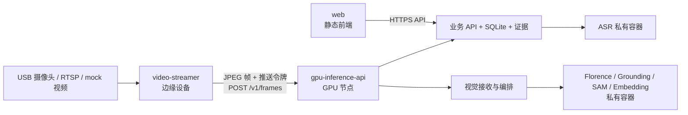

# Where Is It 架构

> 当前生产架构按三个可独立交付的服务包组织：视频推流、GPU 推理与 API、Web 前端。源码目录中的模型和 ASR 进程是 GPU 包内部实现，不是独立生产服务。更新：2026-08-02。

## 1. 部署边界

| 服务包 | 运行位置 | 对外职责 | 不在其边界内 |
| --- | --- | --- | --- |
| `video-streamer` | 能访问摄像头的边缘设备 | 抓取 USB、RTSP 或 mock 视频；发送最新 JPEG 帧 | 模型、ASR、业务数据、录像 |
| `gpu-inference-api` | Linux GPU 节点 | 帧接收、视觉模型、ASR、物品查询、证据与 SQLite | 向公网暴露模型/ASR |
| `web` | 静态站点或 Web 服务器 | 查询、语音录入、结果和证据展示 | 摄像头、推流、模型、ASR 内部地址 |

## 2. 网络与访问控制

| 发起方 | 目标 | 入口 | 控制 |
| --- | --- | --- | --- |
| 推流服务 | GPU 接收器 | `POST /v1/frames`，默认 `8001` | `X-Vision-Push-Token`；生产使用 HTTPS |
| 浏览器 | GPU API | API 根地址，默认 `8000` | `PUBLIC_API_URL` 与 `WEB_ALLOWED_ORIGINS` |
| GPU 内部组件 | 接收器、模型、ASR | Compose DNS，内部 `8001`–`8006` | 不映射宿主机端口 |

GPU 包仅发布 API `8000` 和接收器 `8001`。`8002`–`8006` 必须保持在 Compose 内部网络。

## 3. 关键数据流

### 视频观测

1. `video-streamer` 从视频源读取一帧，编码为 JPEG，并带推送令牌发送到 GPU 接收器。
2. GPU 接收器仅保留最新帧；无法及时处理、网络错误或鉴权失败时丢弃该帧。
3. 视觉编排器调用内部 Florence、Grounding、SAM 与 Embedding，归一化有效观测。
4. API 将确认的观测、位置和证据写入 SQLite；API 是唯一业务事实写入者。

### 文字和语音查询

1. Web 只调用 `PUBLIC_API_URL` 指向的 API。
2. 音频由 API 转发到内部 ASR；浏览器不访问 ASR。
3. API 返回结构化查询结果，明确区分当前检测、最后一次确定位置和推测位置。

## 4. 数据与故障语义

`api-data` 卷保存 SQLite 与证据图片，`model-cache` 卷保存模型下载。推流和 Web 不保存业务事实；接收器不保存视频档案。

推流故障会丢弃当前帧，不能把旧帧当作实时结果。模型或 ASR 不可用时，API 应返回已有事实和明确降级状态；未验证的模型结果不得写成物品位置事实。

## 5. 配置与运维

| 服务 | 环境模板 | 核心变量 |
| --- | --- | --- |
| 视频推流 | `deploy/video-streamer/.env.example` | `CAMERA_SOURCE`、`FRAME_INGEST_URL`、`VISION_PUSH_TOKEN` |
| GPU 推理 API | `deploy/gpu-inference-api/.env.example` | `GPU_VISION_PUBLIC_URL`、`WEB_ALLOWED_ORIGINS`、`VISION_PUSH_TOKEN` |
| Web | `deploy/web/.env.example` | `PUBLIC_API_URL` |

`VISION_PUSH_TOKEN` 在推流和 GPU 包中必须相同。GPU 主机安装与 CUDA 预检见 [GPU 服务部署说明](../deploy/gpu-inference-api/README.md)，逐步启动和排障见 [服务运行手册](service-runbook.md)，传输细节见 [远程视频推流](remote-video-push.md)。

GPU 推理包不提供 CPU 或 mock 后备路径；缺少 NVIDIA GPU 或真实模型时，部署必须以未就绪状态失败。摄像头侧仍可使用视频文件作为测试帧源。