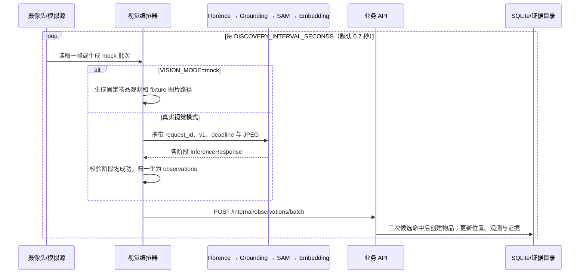
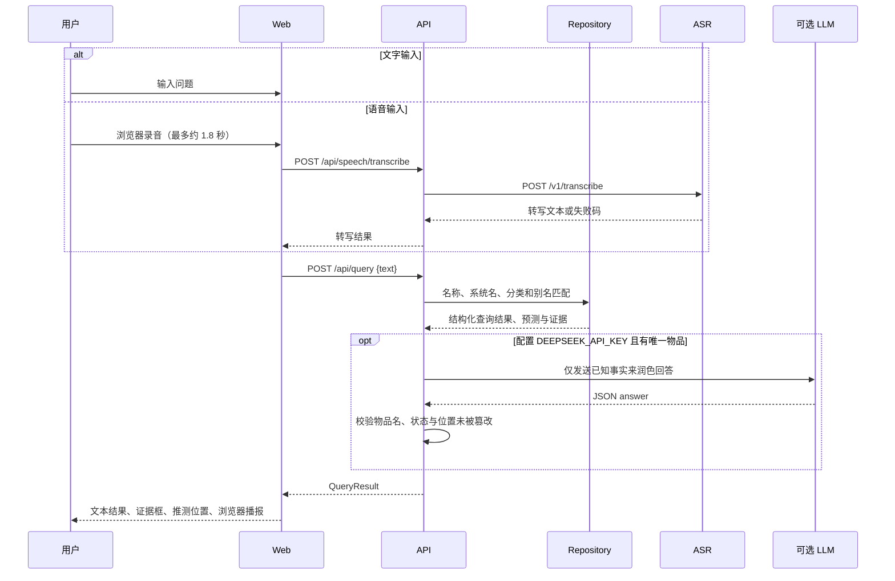
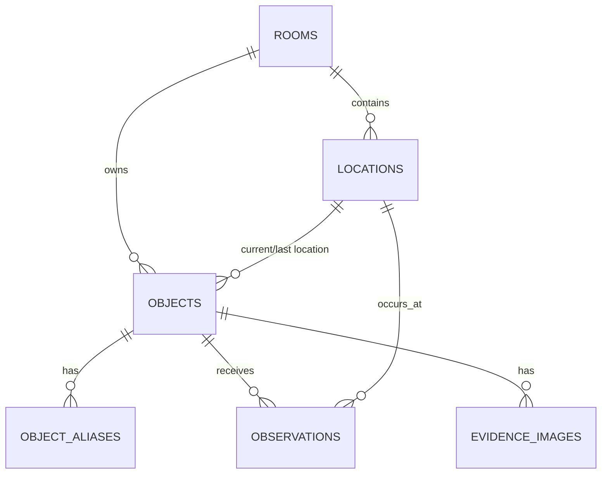

# Where Is It 项目总体架构

> 本文基于当前仓库实现整理，描述的是已落地的代码边界与运行行为，而非未来规划。更新时间：2026-08-01。

## 1. 项目定位与设计原则

Where Is It（“在哪里”）是一个面向单房间、单摄像头场景的室内物品查找助手。用户可用文字或语音询问物品位置；系统将**当前已检测到**、**当前未检测到时的最后确定位置**、以及**推测位置**明确区分，并提供对应的观测证据图。

当前实现以本地演示闭环为主：默认使用 mock 摄像头、mock 视觉模型与 mock ASR，但服务边界、内部推理契约和 CPU/GPU 部署配置已为真实模型接入预留。

核心原则如下：

- API 是物品、位置、观测和证据事实的唯一持久化写入者。
- 视觉编排器与模型服务只产生推理或归一化后的观测，不能直接写 SQLite。
- 模型故障、超时或契约不匹配时，不把未经验证的结果写成物品位置事实。
- 查询回答中，“已检测到”“最后一次确定位置”“推测”使用不同状态与字段表达，避免把推测伪装成事实。
- 每个内部推理请求带有请求 ID、契约版本、时限和媒体引用，以支持追踪与独立演进。

## 2. 仓库结构

```text
where-is-it/
├─ apps/
│  └─ web/                         React 19 + Vite 浏览器前端
├─ packages/
│  └─ contracts/                   前端共享的 TypeScript API 类型与枚举
├─ services/
│  ├─ api/                         FastAPI 业务 API、SQLite 仓储、查询与证据
│  ├─ vision-orchestrator/         摄像头帧获取、视觉流水线编排、观测上报
│  ├─ florence/                    Florence 视觉模型服务入口
│  ├─ grounding/                   Grounding DINO 模型服务入口
│  ├─ sam/                         SAM 2 分割模型服务入口
│  ├─ embedding/                   DINOv2 向量模型服务入口
│  ├─ asr/                         语音转写服务（mock / faster-whisper）
│  ├─ model_runtime/               四个视觉模型服务共用的运行时与真实适配器
│  └─ shared/                      Python 内部推理契约与 HTTP 客户端
├─ docs/                           运维与架构文档
├─ openspec/                       已归档及进行中的需求、设计和验收规格
├─ docker-compose.yml              基础服务编排
├─ docker-compose.cpu.yml          CPU profile 覆盖配置
├─ docker-compose.gpu.yml          NVIDIA GPU profile 覆盖配置
└─ package.json                    pnpm workspace 的统一开发、构建、检查命令
```

`pnpm-workspace.yaml` 将 `apps/*`、`services/*` 和 `packages/*` 组织成一个 pnpm monorepo。JavaScript 侧只有 Web 与 contracts 包；Python 服务共享同一个 `services` 源码树。

## 3. 逻辑组件与调用关系

```mermaid
flowchart LR
  User["用户"] --> Web["Web 前端\nReact + Vite"]
  Web -->|"HTTP /api/*"| API["业务 API\nFastAPI :8000"]
  Web -->|"multipart 音频"| API
  API --> DB[("SQLite + WAL")]
  API --> Evidence["证据图片目录"]
  API -->|"/v1/transcribe"| ASR["ASR 服务 :8006"]
  Camera["模拟视频 / 文件 / USB / RTSP"] --> Vision["视觉编排器 :8001"]
  Vision -->|"观测批次\n/internal/observations/batch"| API
  Vision --> Florence["Florence :8002"]
  Florence --> Grounding["候选标签"]
  Vision --> Grounding["Grounding :8003"]
  Vision --> SAM["SAM :8004"]
  Vision --> Embedding["Embedding :8005"]
  Web -->|"预览帧 / mock 视频"| Vision
  API -. "可选、只负责措辞" .-> LLM["DeepSeek Chat API"]
```



图中的 Florence 到 Grounding 表示候选标签的数据依赖；实际 HTTP 调用均由视觉编排器发起。Embedding 当前会被调用并返回向量结果，但编排器尚未将这些向量用于跨帧身份匹配或持久化。

### 3.1 服务职责

| 服务 | 默认端口 | 主要职责 | 是否写业务数据 |
| --- | ---: | --- | --- |
| `apps/web` | 5173（开发）/ 80（容器） | 查询、语音录制、目录查看、证据显示、浏览器播报 | 否 |
| `services/api` | 8000 | 公开 API、SQLite 迁移、观测入库、查询解析、证据管理、ASR/LLM 适配 | **是，唯一写入方** |
| `services/vision-orchestrator` | 8001 | 轮询摄像头/fixture、串联视觉阶段、跟踪 key、向 API 上报观测、提供预览资源 | 否 |
| `florence` | 8002 | 目标检测/描述的第一阶段 | 否 |
| `grounding` | 8003 | 按候选标签进行目标定位与验证 | 否 |
| `sam` | 8004 | 为检测框生成分割结果与 `mask_area` | 否 |
| `embedding` | 8005 | 为物体裁切区生成 DINOv2 特征向量 | 否 |
| `asr` | 8006 | 接受音频字节并返回转写文本 | 否 |

## 4. 两条核心业务链路

### 4.1 视觉观测入库链路



具体规则：

1. 编排器启动后台线程，按 `DISCOVERY_INTERVAL_SECONDS` 调用 `publish_once`。mock 模式直接生成十个固定的物品观测；真实模式从 mock 视频、文件、USB 或 RTSP 读取 JPEG。
2. 真实模式顺序调用 Florence、Grounding、SAM、Embedding。任何一个阶段失败、返回降级结果或无有效目标时，本帧不向 API 上报观测。
3. 每次 `/v1/infer` 请求遵循 Python 侧 `services/shared/contracts.py` 的 `v1` 契约。请求包含 `request_id`、`contract_version`、`deadline_ms`、来源、帧/媒体引用和 payload；响应回传模型名、版本、状态、结果或结构化错误。
4. API 的 `Repository.ingest_observations` 按 `track_key` 维护候选命中数；此前未见过的物体必须在连续累计 **3 次**匹配观测后，才会创建为目录物品。
5. 已存在物体会更新为 `currently_detected`，写入当前/最后位置、置信度和观测时间。每次观测都会记录在 `observations` 表中。
6. 每个物品首次成功写入时，会从当前帧 Base64 JPEG 或 fixture 文件复制一张证据图片，并建立 `evidence_images` 记录。当前代码只在首张证据不存在时保存新图片；配置中的证据保留上限已定义，但尚未在仓储逻辑中实施清理。

### 4.2 用户查询与语音链路



查询并不调用视觉模型，而是读取已持久化的事实。仓储层会对文本做小写、去空白和“我的 / 在哪 / 在哪里”等词的简化，然后比对物品名称、系统名、分类与别名：

- 无候选：返回 `not_found`，附带最多三个已有物品建议。
- 多个候选：返回 `clarification`，前端要求用户选择具体物品。
- 唯一候选且状态为 `currently_detected`：返回当前位置与最新证据。
- 唯一候选且为 `identity_uncertain`：明确说明身份未确认，不当作确定位置。
- 唯一候选且为 `not_currently_detected`：返回最后一次确定位置，并额外给出带 `is_inference: true` 的预测位置和依据。

DeepSeek 是可选的回答措辞层：未配置密钥、请求失败或安全校验不通过时，API 使用本地规则回答；它不参与位置判断，也不写数据库。

## 5. API 与数据契约

### 5.1 浏览器可调用的 API

| 方法与路径 | 用途 | 关键返回 |
| --- | --- | --- |
| `GET /api/room/state` | 获取摄像头资源 URL、目录统计和视觉状态 | `camera.frame_url`、`camera.stream_url` |
| `GET /api/objects` | 获取物品目录 | `CatalogObject[]` |
| `PATCH /api/objects/{object_id}` | 修改展示名称及别名 | 更新后的物品；名称冲突时 409 |
| `GET /api/locations` | 获取位置目录及当前物品数 | `Location[]` |
| `PATCH /api/locations/{location_id}` | 修改位置名称 | 更新后的位置；名称冲突时 409 |
| `POST /api/query` | 执行文字查找 | `QueryResult` |
| `GET /api/evidence/{evidence_id}` | 获取保存的证据图 | 图片文件 |
| `POST /api/speech/transcribe` | 转发音频到 ASR | `TranscriptionResult` |

内部写入口 `POST /internal/observations/batch` 仅供视觉编排器上报标准化观测，不应暴露给不可信客户端。

TypeScript 前端共享类型位于 `packages/contracts/src/api.ts`，Python 侧的同类请求/响应模型位于 `services/api/app/models.py`。两套类型都定义了下列关键状态：

| `ObjectState` | 含义 | UI 呈现原则 |
| --- | --- | --- |
| `currently_detected` | 当前帧/近期观测确认存在 | 展示“当前检测”和当前位置 |
| `not_currently_detected` | 当前未被检测到，但有历史观测 | 展示最后确定位置；推测必须单独标识 |
| `identity_uncertain` | 检测到候选但身份不能确认 | 不输出确定位置 |

`QueryResult` 同时容纳答案、状态、单个物品、`predictions`、证据、歧义选项和耗时字段。前端依据这些结构化字段，而不是从自然语言答案中猜测展示状态。

### 5.2 内部视觉推理契约

四个模型服务统一暴露：

- `GET /health/live`：进程存活；
- `GET /health/ready`：模型/mock 适配器是否可接受推理；
- `POST /v1/infer`：遵循版本化内部推理请求与响应。

Python 的 `InternalServiceClient` 对 HTTP 错误进行统一转换：422 映射为 `contract_mismatch`，408/504 映射为 `deadline_exceeded`，其他网络/服务错误映射为 `service_unavailable`。模型服务还会返回 `model_not_ready` 或 `invalid_request`。编排器在失败时记录阶段状态，并终止当前帧上报。

## 6. 持久化模型

业务 API 使用 SQLite，并在每个连接启用外键与 WAL 日志模式。默认开发数据库是 `services/api/data/mock-where-is-it.db`；容器环境挂载到名为 `api-data` 的持久卷。



| 表 | 作用 |
| --- | --- |
| `rooms` | 房间根实体。当前实现会使用“Mock 卧室”接收视觉观测；演示种子数据使用“我的卧室”。 |
| `locations` | 房间内位置，保存名称、标准化名称和预留的多边形 JSON。 |
| `objects` | 稳定物品身份、展示名、系统识别名、分类、状态、当前/最后位置、置信度和观测时间。 |
| `object_aliases` | 面向自然语言匹配的物品别名。 |
| `observations` | 每次确认观测的时间、位置、边界框和置信度。 |
| `evidence_images` | 证据文件路径、对应物品、时间与边界框。 |
| `observation_candidates` | 按 `source_key` 记录候选命中数，用于“三次命中后创建”的防抖规则。 |
| `schema_migrations` | 当前简易 schema migration 版本记录。 |

物品和位置分别以“房间内标准化名称”建立唯一索引。重命名只更新显示名/标准化名及别名，不修改物品 ID、位置关联或历史观测，因此可保持身份与历史连续。

## 7. 前端架构与当前功能范围

前端是单页 React 应用，入口为 `apps/web/src/main.tsx`，核心 UI 集中在 `App.tsx`，网络封装集中在 `api.ts`。它通过固定的 `http://127.0.0.1:8000` 访问业务 API；容器部署时需由反向代理、同源转发或相应构建配置解决该地址问题。

已实现的页面/交互：

- **查找**：文本输入、浏览器麦克风录音、ASR 转写、查询结果、歧义选择、证据弹窗、预测位置和 Web Speech API 播报。
- **物品目录**：加载物品、展示状态和当前位置/最后位置，支持重命名。
- **位置目录**：展示位置与当前关联数量，支持选中；页面上的“编辑区域”目前没有接入编辑动作。
- **摄像头预览**：优先播放编排器提供的 mock MP4，失败时回退到静态帧；查询证据存在时叠加边界框。

“历史记录”导航项目前是占位页面，尚未读取 `observations` 表形成时间线。位置重命名后端已提供接口，但前端尚未接入实际编辑控件。

## 8. 模型运行时与可替换性

`services/model_runtime/app.py` 将通用的 FastAPI 端点、健康检查、并发信号量、错误处理和 mock 结果封装为 `create_model_app(service_name)`；四个模型服务的 `app/main.py` 只负责指定服务名称。因此它们可独立部署、独立扩容和独立配置设备。

| 服务 | 真实适配器 | 默认模型标识 | 当前编排用途 |
| --- | --- | --- | --- |
| Florence | `FlorenceAdapter` | `florence-community/Florence-2-base` | 目标候选/描述 |
| Grounding | `GroundingAdapter` | `IDEA-Research/grounding-dino-tiny` | 目标定位、标签验证 |
| SAM | `SamAdapter` | `facebook/sam2.1-hiera-tiny` | 分割与面积过滤 |
| Embedding | `EmbeddingAdapter` | `facebook/dinov2-small` | 裁切区域特征 |

`MODEL_MODE=mock` 是默认值，模型服务不会下载或加载真实权重。切换为真实模式时，适配器按需导入 Pillow、Torch 和 Transformers，使用 `MODEL_DEVICE` 与模型缓存目录；若模型未就绪，`/health/ready` 返回 503。模型服务使用 `MODEL_MAX_CONCURRENCY` 限制并发请求，默认值为 1。

ASR 独立于视觉运行时：

- `ASR_MODE=mock` 时返回可配置的固定文本；
- `ASR_MODE=faster-whisper` 时惰性加载 `faster-whisper` 的 WhisperModel；
- 支持 webm、wav、mpeg、mp4，默认最大 10 MiB；
- API 与 ASR 都在失败时返回结构化错误码，不会凭空构造查询文本。

## 9. 配置、启动与部署

### 9.1 本地开发

```powershell
pnpm install
python -m pip install -r services/api/requirements.txt
pnpm dev
```

`pnpm dev` 并行启动 Web、API、视觉编排器、四个模型服务和 ASR；`pnpm dev:core` 只启动 Web/API/视觉编排器/ASR；`pnpm dev:models` 只启动四个视觉模型服务。

默认开发模式依赖 `.env`（可参考 `.env.example`）：

- `VISION_MODE=mock`、`MODEL_MODE=mock`、`ASR_MODE=mock`，可在没有真实模型/GPU 的机器上完成演示；
- `CAMERA_SOURCE` 可取 `mock-video`、`file`、`video`、`usb` 或 `rtsp`；
- `VISION_PUBLIC_URL` 供 API 生成浏览器可访问的相机资源 URL；
- `ASR_SERVICE_URL` 和四个 `*_SERVICE_URL` 配置跨服务地址；
- `DEEPSEEK_API_KEY` 为空时自动使用本地规则回答。

### 9.2 Docker Compose

基础 `docker-compose.yml` 创建 web、api、vision-orchestrator、四个模型服务与 asr，并提供 `api-data` 和 `model-cache` 两个命名卷：前者保存 SQLite 与证据，后者保存模型缓存。

- CPU：`docker compose -f docker-compose.yml -f docker-compose.cpu.yml --profile cpu up --build`
- Linux NVIDIA GPU：`docker compose -f docker-compose.yml -f docker-compose.gpu.yml --profile gpu up -d --build`

GPU 覆盖文件将每个视觉模型服务分别声明为 GPU profile 服务，并分别保留一张 NVIDIA GPU 的设备声明。这样的服务边界避免默认假设所有模型能同时放入同一张显卡；是否同卡运行以及并发策略由部署配置决定。

### 9.3 健康检查与验证

常用检查地址：

| 组件 | 存活/就绪地址 |
| --- | --- |
| API | `http://127.0.0.1:8000/health/live`、`/health/ready` |
| 视觉编排器 | `http://127.0.0.1:8001/health/live`、`/health/ready` |
| 各视觉模型 | `http://127.0.0.1:8002` 至 `8005` 的 `/health/live`、`/health/ready` |
| ASR | `http://127.0.0.1:8006/health/live`、`/health/ready` |

仓库统一命令：

```powershell
pnpm build
pnpm contracts:check
pnpm test
pnpm lint
```

其中 Web 使用 Vite/TypeScript/Vitest，Python 侧 API、ASR 与视觉编排器包含 `unittest` 测试；`pnpm lint` 还会对 Python 服务源码执行 `compileall`。

## 10. 当前实现边界与后续注意点

- 默认视觉流程是可运行的 mock 闭环；真实模型需要额外安装模型依赖、提供权重和验证相机输入，当前 Compose 基础镜像并不自动安装 Torch/Transformers。
- 真实视觉流程虽调用 Embedding，但尚未保存或使用向量进行跨帧 re-identification；跟踪目前依赖标签与 IoU 的 `TrackStore`。
- `FRESHNESS_SECONDS` 和 `MISSING_GRACE_SECONDS` 已配置，但当前仓储层尚未根据它们把过期物品转为 `not_currently_detected`。
- 证据容量/每物品保留数配置已定义，当前代码尚未实现淘汰策略；运行生产环境前应补充保留、清理和磁盘监控。
- API 的 CORS 只允许 Vite 本地开发地址；Web API 基址也固定为 `127.0.0.1:8000`。生产部署需要把它们改为可配置的同源/反代方案。
- 内部观测写入口当前没有鉴权；生产环境应限制网络可达性，并添加服务间认证、请求签名或网关策略。
- `locations.polygon_json` 是预留字段，前端区域编辑与历史记录页面仍未完成。

## 11. 代码导航

| 关注点 | 首选入口 |
| --- | --- |
| Web UI、录音与结果展示 | `apps/web/src/App.tsx` |
| Web HTTP 封装 | `apps/web/src/api.ts` |
| 公开 API 路由 | `services/api/app/main.py` |
| SQLite schema、入库与查询规则 | `services/api/app/repository.py` |
| API 请求/响应模型 | `services/api/app/models.py` |
| 视觉编排、摄像头和上报 | `services/vision-orchestrator/app/main.py` |
| 内部推理契约与客户端 | `services/shared/contracts.py`、`services/shared/client.py` |
| 通用模型服务运行时 | `services/model_runtime/app.py` |
| 真实模型适配器 | `services/model_runtime/adapters.py` |
| ASR 服务与 faster-whisper 适配 | `services/asr/app/main.py` |
| 架构约束的规格来源 | `openspec/specs/*.md` |

