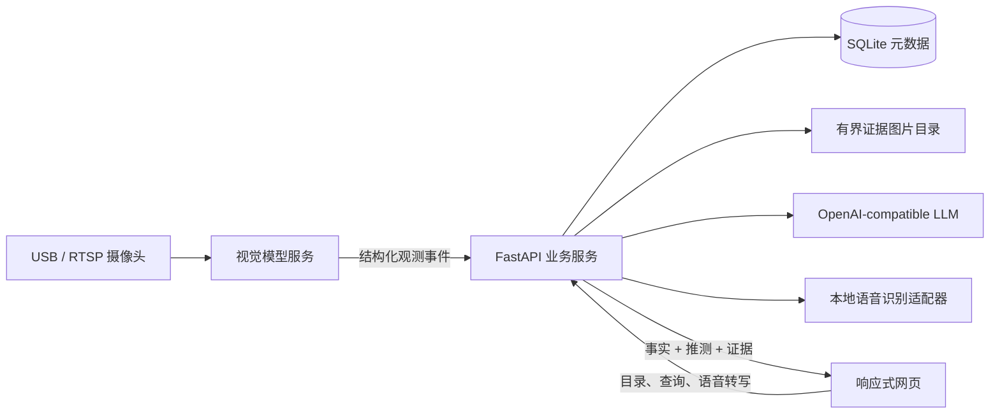

## Context

参见 [proposal.md](./proposal.md) 的动机与产品范围。当前仓库没有既有代码或数据，需要从零建立响应式网页、应用 API、视觉推理服务、摄像头采集、LLM 编排和有界证据存储。首版部署在连接单个卧室摄像头的单机环境中，优先保证可演示、可解释和可继续扩展，而不是覆盖所有家庭场景。

核心约束如下：

- 用户不应逐件预登记；物品和位置由系统先发现、命名，用户只在需要时修正。
- 必须区分具体实例，而不是只识别类别。
- 位置回答必须严格区分当前事实、最后事实和推测。
- 查询文字结果目标为五秒内返回，重型视觉推理不能位于同步查询关键路径。
- 只保存有意义的限量证据图片，不保存连续录像。
- 首版需要在 Windows 开发环境和带 NVIDIA GPU 的演示环境可部署；CPU 模式作为低帧率兼容路径。

## Goals / Non-Goals

**Goals:**

- 形成职责清晰、可以替换模型或界面的模块化完整工程。
- 在后台持续更新结构化位置记忆，使查询成为低延迟读取与受约束语言生成。
- 自动建立至少十个具体物品和卧室语义位置的唯一目录。
- 通过类型化数据合同阻止 LLM 将推测改写为确定事实。
- 提供实时摄像头、录制样例两种输入，便于现场演示与自动测试。

**Non-Goals:**

- 首版不训练自有基础视觉模型，不承诺两个外观完全相同物品的可靠重识别。
- 不建立复杂分布式消息系统，不引入 Redis、Kafka 或独立向量数据库。
- 不让 LLM 直接观看连续视频或决定物品的确定位置。
- 不优化多房间、多摄像头、多用户或云端横向扩展。
- 不把摄像头盲区、关闭的抽屉内部或房间外部描述成可观测空间。

## Decisions

### 1. 采用单仓库、四层运行架构

工程使用以下边界：

- `apps/web`：React、TypeScript、Vite 的响应式网页，负责目录编辑、摄像头状态、文字/语音问答和证据查看。
- `services/api`：Python FastAPI 应用，是业务数据的唯一写入者，负责目录、位置记忆、查询编排、LLM 约束和文件服务。
- `services/vision`：独立 Python 进程，负责摄像头/录像输入、视觉模型、跟踪、重识别和观测事件生成，通过内部 HTTP 批量提交类型化观测。
- `packages/contracts`：OpenAPI 模型和生成的 TypeScript 客户端，保证前后端状态枚举一致。

API 作为 SQLite 和图片索引的单写者，避免 vision 与 web 并发写库。视觉服务可以崩溃并重启而不破坏已有位置记忆；API 在视觉服务离线时把最新状态标记为过期。

**替代方案：** 将所有逻辑放在一个 Python 进程更简单，但模型推理可能阻塞 API，也不利于后续更换 GPU 服务；引入完整微服务和消息队列则超过概念验证需要。

### 2. 视觉感知采用“发现 + 分割跟踪 + 实例特征”组合，而非单一检测器

首选 GPU 模型组合：

- Florence-2-base-ft：对初始和周期关键帧执行密集区域描述、类别与可见属性提取，提供自动命名原料。
- Grounding DINO：使用动态卧室物品/家具词表做开放词汇定位与候选复核。
- SAM 2.1 Hiera Tiny：把候选框转为掩码，并在相邻帧传播具体目标以维持时空连续性。
- DINOv2 ViT-S/14：从物品裁剪图生成实例外观向量，结合颜色直方图、OCR 文本和尺寸比例做遮挡后的重识别。

上述模型均封装在 adapter 接口后，模型名、权重和阈值从配置读取。CPU 兼容模式降低发现频率，并允许将 SAM 跟踪替换为轻量框跟踪；它保证功能可运行，但不承诺与 GPU 模式相同的实时性。

模型选择依据：Florence-2 同时支持检测和密集区域描述，适合无预登记命名；Grounding DINO 提供开放词汇检测；SAM 2.1 支持多物品视频分割跟踪；DINOv2 提供无需专门训练的视觉特征。它们分别解决不同问题，避免要求单个通用模型同时完成发现、命名和实例持续身份。

**替代方案：** 只使用固定类别 YOLO 推理更快，但无法满足用户自动添加任意具体物品；只使用通用 VLM 逐帧问答难以保持稳定实例身份，且延迟和输出格式不可控。

### 3. 感知流水线持续运行，查询绝不触发重型视觉推理

摄像头采集默认使用 1280×720。视觉服务维护三种节奏：

1. 采集线程持续获取最新帧，旧帧可丢弃，不形成录像队列。
2. 重型发现默认每 1～2 秒运行一次，用于发现新物品、家具和校正跟踪。
3. SAM/轻量跟踪在中间帧维护目标连续性，并批量提交稳定观测。

初始建议阈值：候选在最近五次发现中命中至少三次才提升为正式或待确认对象；最近确定观测不超过三秒可视为新鲜；连续五秒无法匹配后转为 `not_currently_detected`。阈值全部配置化，验收前使用现场录像校准。

同步查询只读取 API 中已提交的最新状态，因此视觉帧耗时不会直接增加问答延迟。

### 4. 具体物品身份使用不可变 ID、特征库和保守匹配

`object_id` 使用 ULID，创建后不可修改。每个物品保存：规范名称、别名、系统生成名称、类别、属性、状态、最多若干个代表性特征向量和版本号。

观测匹配采用分层策略：

1. 活跃 SAM track id 和时空连续性优先。
2. 对重新出现的候选，综合类别一致性、DINOv2 余弦相似度、颜色/OCR 属性、空间距离。
3. 使用全局一对一匹配，禁止一帧中两个候选同时绑定同一 `object_id`。
4. 第一名与第二名分数过近或低于阈值时产生 `identity_uncertain`，不更新确定位置。

系统名称由视觉属性构造成“颜色/材质/用途 + 类别”，必要时由受约束 LLM 润色。规范名称在归一化列上加唯一约束；冲突时优先加入空间或外观属性，仍冲突则追加序号。用户重命名只更新展示字段，不更新 ID 或历史关联。

**替代方案：** 仅依赖 tracker id 在遮挡或进出画面后会失效；仅依赖向量最近邻容易把外观相似物品合并。

### 5. 位置目录由持久静态区域自动生成，再允许用户覆盖

初始扫描以常见卧室静态实体词表（床、书桌、床头柜、衣柜、门、地面、椅子等）运行开放词汇检测，并用多帧一致性合并为持久区域。每个位置使用不可变 `location_id`、唯一规范名称、区域几何、多边形/掩码、父级位置和置信度。

位置名称优先使用语义实体与空间关系，例如“床左侧床头柜”；规范化后必须唯一。用户可在摄像头画面叠层中重命名或调整多边形。位置判断使用物品掩码与区域的交叠、物品底部中心点及父子层级；左/中/右、上方/下方等相对描述由确定性几何规则生成。无法可靠落入已确认区域时写入系统保留的唯一“未分区区域”，而不是让 LLM 猜测家具。

### 6. 位置记忆使用事件模型，证据图片按变化保存

SQLite 开启 WAL，核心实体为：

- `rooms`
- `objects`、`object_aliases`、`object_feature_refs`
- `locations`、`location_revisions`
- `observations`
- `object_state`
- `evidence_images`
- `query_logs`

`object_state` 是查询优化用的最新快照，`observations` 是可解释事件。只有以下情况默认保存 JPEG 证据：首次稳定观测、确定位置变化、身份状态变化、转为不可见前的最后确定观测，以及可配置的低频刷新。边界框/掩码、时间和原始名称快照存为元数据，页面查看时动态绘制标记，不重复保存带框图片。

默认每个物品最多二十张证据、全局 512 MiB。清理顺序为最旧非保留证据优先；每个物品最新一张证据受到保护，直到该物品被删除。数据库删除和文件删除使用补偿任务处理，启动时执行孤儿文件扫描。系统不写入连续视频。

**替代方案：** 保存固定时长录像更容易回放，但会快速占用存储且违背当前产品边界；只存最后一张则无法解释移动过程。

### 7. 推测由可审计评分器产生，LLM 只负责表达

预测候选只在 `not_currently_detected` 时计算，输入包括：最后确定位置及时间、消失边界、邻近区域、该物品历史位置迁移频率。初始评分建议为：最后位置与时间衰减 0.55、消失点邻接 0.25、历史迁移先验 0.20；数据不足时只返回最后位置仍可能存在这一候选，或返回无法可靠推测。

候选去重后最多三个，按分数排序，并映射为高/中/低置信等级。响应结构分别包含 `facts` 与 `predictions`；预测对象必须带 `is_inference=true` 和 `basis`。LLM 接收这一只读结构，不得新增位置 ID。服务端在返回前验证答案中引用的物品、位置、状态和时间均存在于结构化结果中，失败时改用确定性模板。

### 8. LLM 使用单次受约束调用，并设超时降级

API 提供 OpenAI-compatible provider adapter，默认建议部署中文非思考小模型（例如本地 Qwen3 4B 级别模型），也可通过环境变量改用远程兼容服务。一次查询流程为：

1. 名称索引先做精确/别名/模糊候选召回。
2. LLM 以工具参数 schema 输出 `FindObjectIntent`，只选择已有候选 ID 或返回需要澄清。
3. API 查询结构化状态并构造事实包。
4. LLM 可基于事实包生成简短中文草稿；答案验证器检查事实边界。
5. LLM 任一步骤超过 2.5 秒、格式错误或不可用时，确定性解析与模板接管。

标准“某物品在哪里”查询具备完整确定性降级路径，因此 LLM 不可用不会使核心功能失效。后续增加“东西是否齐全”等意图时继续使用工具 schema 扩展，而不是让模型直接访问数据库。

### 9. 语音输入优先本地转写，语音输出使用浏览器能力

网页通过 `MediaRecorder` 获取单次语音，上传到 `/api/speech/transcribe`。默认 ASR adapter 使用 `faster-whisper` 小型中文兼容模型；可配置使用浏览器 SpeechRecognition 快速路径。转写结果先显示为可编辑文字，再按用户设置自动提交。

语音输出使用浏览器 `speechSynthesis`，文字回答先渲染，再开始播报，从而不把语音初始化计入查询关键路径。前端提供重播、停止、静音和麦克风权限错误处理。首版正式支持最新版 Chrome/Edge；其他浏览器保留文字功能。

### 10. 五秒目标通过预计算、预算和逐级降级保障

查询预算建议：实体候选召回 100 ms、LLM 意图/回答总计最多 2.5 s、数据库与预测 200 ms、序列化和网络 500 ms，保留约 1.7 s 余量。证据原图采用懒加载，回答先返回缩略图 URL 和元数据。服务启动时预热名称索引与 LLM 连接；视觉模型预热不阻塞已有目录查询。

验收脚本对十个具体物品执行二十次混合查询，记录从服务收到最终文字到前端展示响应的端到端时间，要求至少十九次不超过五秒。指标分解记录 `resolve_ms`、`lookup_ms`、`llm_ms`、`total_ms`，便于定位退化。

### 11. API 和错误状态均为类型化合同

主要接口：

- `GET /api/room/state`：摄像头、视觉服务和目录摘要。
- `GET/PATCH /api/objects`：物品目录、重命名和别名。
- `GET/PATCH /api/locations`：位置目录、重命名和区域修正。
- `POST /api/query`：文字查询并返回 `answer`, `status`, `facts`, `predictions`, `evidence`。
- `POST /api/speech/transcribe`：单次音频转写。
- `GET /api/evidence/{id}`：鉴权预留的证据文件读取。
- `POST /internal/observations/batch`：视觉服务提交观测。
- `GET /health/live`、`GET /health/ready`：部署检查。

状态枚举、时间均通过 OpenAPI 生成前端类型；时间内部使用 UTC ISO 8601，界面按本地时区显示。对摄像头离线、模型未就绪、目录为空、证据被清理和 LLM 降级分别返回可展示错误码。

### 12. 部署以 Docker Compose 为主，并提供无 GPU 演示路径

交付 `docker-compose.yml`、GPU override、`.env.example`、模型下载脚本和 PowerShell 启动脚本。模型权重与证据目录使用宿主机卷，不写入容器层。默认服务包括 web、api、vision；本地 LLM/ASR 可由 profile 启用或指向已有 OpenAI-compatible endpoint。

自动测试使用录制的短视频夹具验证身份、位置和遮挡状态，不依赖真实摄像头。现场模式通过配置切换 USB 摄像头索引或 RTSP URL。首次启动执行数据库迁移、目录权限检查和模型就绪检查。

## Risks / Trade-offs

- **[开放世界自动发现会产生漏检和误命名]** → 使用多帧晋级、置信状态和可编辑目录；命名错误不改变唯一身份。
- **[外观近乎相同的同类物品无法稳定重识别]** → 综合时空与外观证据，分数接近时标记身份不确定，不伪造确定位置。
- **[单摄像头存在遮挡和盲区]** → 产品明确区分当前未检测到、最后位置与推测；不把盲区当作已观察区域。
- **[四个视觉模型争用显存并降低帧率]** → 模型顺序调度、使用 tiny/small 权重、降低发现频率；查询读取后台快照，不等待视觉推理。
- **[LLM 延迟或幻觉破坏五秒目标和事实边界]** → 单次受约束调用、2.5 秒预算、ID 白名单验证和确定性模板降级。
- **[浏览器或现场网络影响语音识别]** → 默认支持本地 ASR，语音文本可编辑；文字输入始终可用。
- **[证据图片长期增长]** → 单物品数量和全局字节双上限、变化触发保存及后台清理。
- **[自动位置区域不准确]** → 多帧静态合并并提供可视化区域编辑器；位置 ID 与名称/几何版本解耦。
- **[CPU 环境无法实时运行完整模型栈]** → 提供低频兼容 profile 和录制样例演示；在产品说明中明确硬件性能边界。

## Migration Plan

1. 初始化数据库和证据目录，仅启用录制样例输入，完成端到端数据合同验证。
2. 启用视觉服务的发现、跟踪与观测提交，使用固定卧室录像校准阈值。
3. 启用实时 USB/RTSP 摄像头，生成首个自动物品和位置目录。
4. 启用 LLM provider、ASR 和浏览器 TTS，执行十物品/二十查询验收。
5. 打包 Docker Compose、PowerShell 脚本和产品说明书。

当前没有旧系统需要迁移。出现严重问题时可停止 vision 服务并保留 SQLite 与证据目录；回滚应用版本不会删除用户目录。数据库迁移脚本必须提供向下兼容备份步骤，禁止部署脚本自动清空数据目录。

## Open Questions

- 最终演示机的 GPU 型号、显存和摄像头接口将决定默认模型 profile 与发现帧率，但不改变服务边界。
- 每物品二十张、全局 512 MiB 是首版默认值，现场测试后可仅通过配置调整。
- 现场浏览器若无法稳定使用本地麦克风编码，将在同一 ASR adapter 下增加 WAV 转码，不改变网页问答合同。
